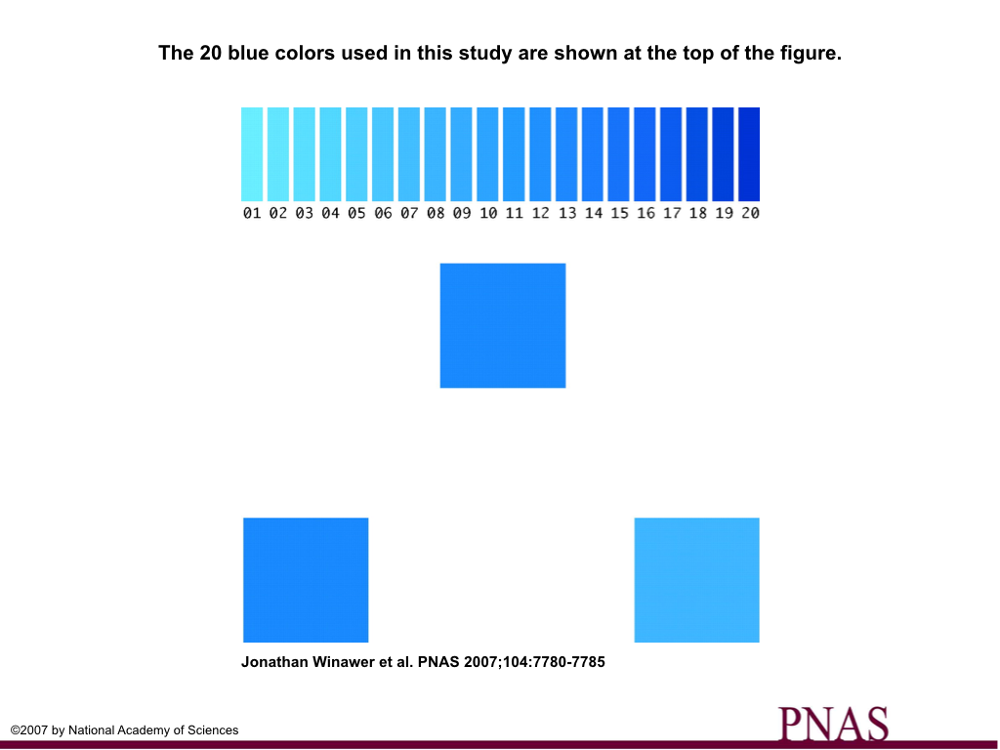
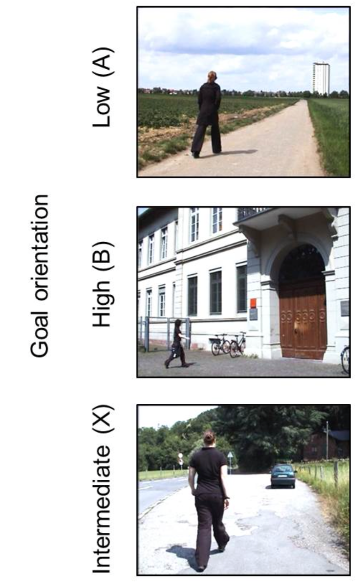
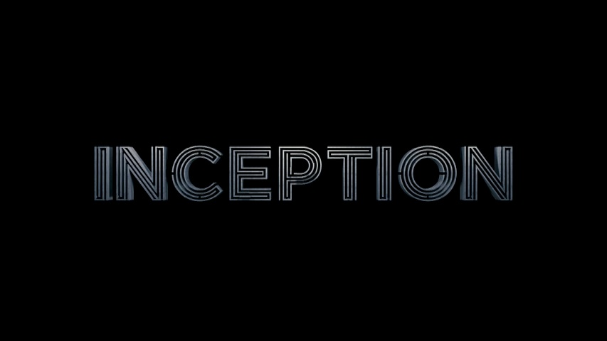
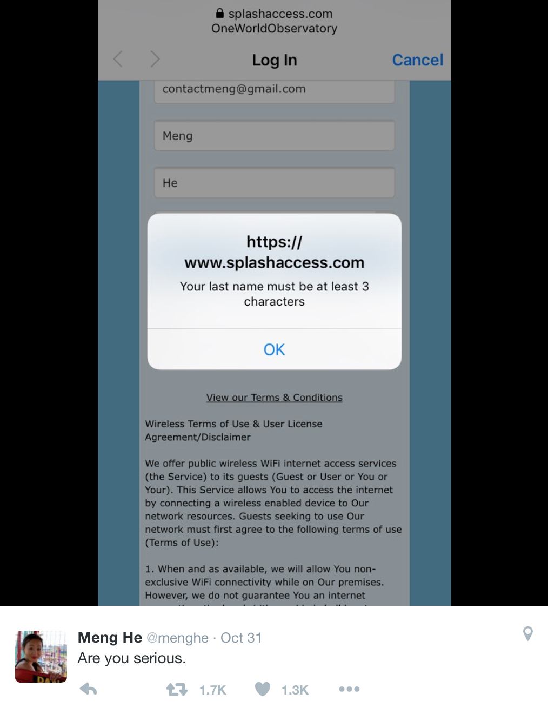
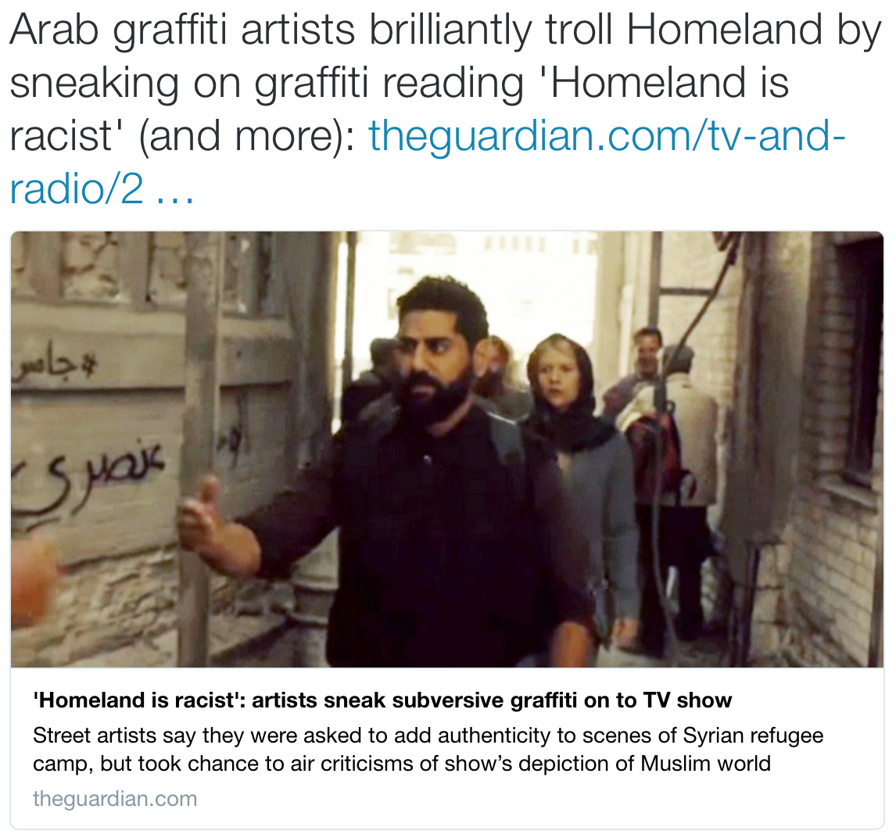
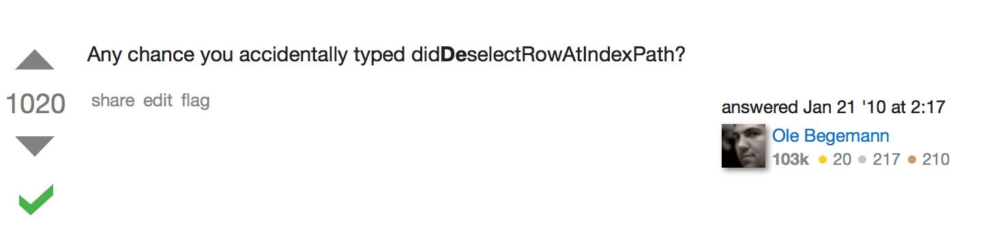

# Languages & *Cultures*
--
--
### @saniul

---

# *✗* *✓*

^I'd like you to look at these two symbols.

^ Which symbol would you say signals rejection? Which one would you use to mark something as incorrect?

^ Most likely you would use the tick for confirmation, and cross for rejection. And it's a totally reasonable choice.

----

# Falsehoods Programmers Believe About

* [Names](http://www.kalzumeus.com/2010/06/17/falsehoods-programmers-believe-about-names/)
* [Time](http://infiniteundo.com/post/25326999628/falsehoods-programmers-believe-about-time)
* [Time II](http://infiniteundo.com/post/25509354022/more-falsehoods-programmers-believe-about-time)
* [Geography](http://wiesmann.codiferes.net/wordpress/?p=15187&lang=en)
* [Addresses](https://www.mjt.me.uk/posts/falsehoods-programmers-believe-about-addresses/)
* [Gender](http://www.cscyphers.com/blog/2012/06/28/falsehoods-programmers-believe-about-gender/)

^ Some of you may be aware of a few entertaining blog posts titled "Falsehoods Programmers Believe".

^ I would say that a lot of those aren't limited to Programmers. If you haven't read these, I encourage you to. It will make you a better programmer and quite possibly a better human being.

----

## Falsehoods People Believe About
#*✓*

----

### ✓ == confirmation, right?

# Nope

^ In some countries (e.g. Finland, Sweden, Russia, Norway, Korea, Japan, Italy), the check mark is often used as an error mark.

^ In our school in Russia teachers marked correct answers with a +. Sweden uses the letter R (for rätt), Finland uses symbol similar to % but with dots instead of "o"s

^ Japan uses circles for "correct" and crosses for "wrong"

----
### So...
# Languages & *Cultures*
^ My name is Saniul and I'm here to talk for a little bit about Languages & Cultures. I'll be talking about the Human side of things while drawing parallels with development side of the topic.

^ Hopefully you'll gain some useful insights from this talk. If not, I hope to at least warm you up for the wonderful Laura Savino who's going to come up next

^ Now it's hard for me to attribute myself to any particular culture and/or language, since I'm basically from all over the damn place.

^ Professionally I'm a Mobile Developer, but I like delving into pretty much everything.

---

### What does this have to do with *App Development*?

^ I believe that every time you learn something about another language and another culture, you become a better developer/app maker.

^ Personally, this kind of knowledge reminds me to scrutinize the parts of my work that influence user-facing elements. It helps me make sure that my design is more empathic.

^ I'll talk more about empathy in a bit, for now – let's talk about another interesting falsehood.

---
### Falsehoods People Believe About *Color*

"Go" traffic lights, forests and leaves are always referred to as "green", instead of any other color

^ Turns out this isn't quite true. When I was in university a friend of mine said something like "let's go, the light's blue". The first time this happened, I didn't really give it much attention, but this became a pattern so I talked to him about it and did some additional research.

---

# Blue
--
## Vegetation
## Apples
## Traffic lights

^ In Japanese, some things that would be called green in other cultures, are referred to as blue.

---

## Grue
--
### Blue 青 ("Ao", JP)
--
### Green 緑 ("Midori", JP)

^ Some regions and languages in East Asia traditionally have the same word for blue and green, indicated with the Chinese character 青 (Ao). More recently, a newer character 緑 (Midori) came to use to specifically mean green rather than blue.

^ However, even today the terms blue and green aren't as distinguished as they would be in English. For example, Japanese speakers refer to forests, leaves and lawns as "blue".

^ There's Japanese term used for inexperienced youths – the literal translation would mean "blue 2-year-old". In English, the equivalent term would be "greenhorn".

---

## Traffic Lights

^ They also call the "go" traffic light color "blue".

^ Now, the first traffic light was installed in 1930 and the "go" color was officially referred to as green. As more traffic lights were installed, people started referring to them as "blue".

^ In 1970s the government decided to bring the actual color of the lights closer to what they were commonly called.

---

## Traffic Lights

^ Problem is, colors of traffic lights are prescribed by an international convention which state that the "go" signal must be green.

^ To still keep it compatible with international standards, the color of the lights was changed to the bluest possible hue of green.

---

### Taking things for granted
--
### Absolute truths

^ We have to remember that it's human nature to take things for granted. Every day we constantly reinforce our own ideas and beliefs. And this is only amplified when surrounded by a like-minded community.

^ It's just how our brains are wired.

^ When faced with an unfamiliar differing point of view, it's easy to jump the gun and call it "wrong" or "weird". Especially when we're talking about something that in everyday life we consider an absolute truth, like what is green and what is blue.

---

### Taking things for granted
--
### Absolute truths

^ But, if you give it 5 minutes, if you spend just a little effort, you might be able to put yourself in the shoes of others and understand their point of view[^1].

^ And I'm sure most of you feel the same about the development community – there's so much negativity and toxicity in our communication.

^ Instead of spending energy on trying to understand each other, it is spent on proving that our side of the story is correct.

[^1]:[Distinction of blue and green in various languages] (https://en.wikipedia.org/wiki/Distinction_of_blue_and_green_in_various_languages)

---

# What color is this?

^ Now, since we're on the topic of the color blue and languages, let's conduct an experiment

^ What color is the background of the slide?

---

# Blue

^ Blue!

^ I would expect everyone here to categorise both as "Blue".

^ However, If I was conducting this experiment with a Russian-speaking audience, most likely these colors would be categorised in two different groups.

---

## Russian Blues

### Two color words

^ As it turns out that there is no single word for the range of colors denoted by the English term “blue” in Russian. The one on the left, what most other languages know as dark blue, would be called "синий". While lighter blue colors, like the one on the right, would be called "голубой".

^ This distinction is similar to how the colors "red" and "pink" are generally considered to be different colors in English.

---

## Russian Blues

### Two color words

^ So, there's obviously a linguistic difference in the way these two languages categorise color

^ The question is, does that mean that Russian speakers and English speakers perceive colors differently?

---

^ There's a study published in 2007, that investigated whether this linguistic difference leads to differences in color perception performance.

^ Subjects were shown three rectangles and were asked to quickly identify which of the bottom two rectangles was the same color as the top rectangle.

---

^ The study found that Russian speakers were faster to discriminate the colors when they were different enough to fall into the different lingustic categories (синий and голубой).

^ Meanwhile English speakers did not show a category advantage in any of the conditions.

---

## Russian Blues[^1]
--
### Linguistic Relativity

^ Interestingly, they had the study participants recite nonsense words (to keep their language centers busy) while performing the study. They found that under this condition, the difference went away.

^ This shows that categories defined in the language we speak do, in fact, affect the performance of our perception.

^ This concept of language affecting the way we percieve the world is called Linguistic Relativity and there's a whole lot of research on it, if you're interested.

[^1]:[Jonathan Winawer et al. PNAS 2007](http://www.pnas.org/content/104/19/7780.abstract)

---

### What does this have to do with *App Development*?

^ What does this have to do with *App Development*?

^+ 5 minutes (10 total)

---

--
### 👨👩👨👩👨👩👨👩
--
### 👩👨👩👨👩👨👩👨

^ A big part of our work is centered around people.

^ We write code that will be read by people.

^ We write comments and documentation to help people understand that code better.

^ We talk about code with people – in person, over chat, in emails, in issues.

^ We design APIs which will be used by people.

---
### What does this have to do with *App Development*?
--
### Bias contributed by language

^ Learning a language, even at a basic level, can make you more aware of the bias contributed by that language to your thoughts.

^ You can become more aware that some pattern of thinking is really just some linguistic convention and not real semantics.

^ For example, you are more likely to spot someone confusing multiple meanings of some term in the same argument. You are more likely to realize: "Doh, in this other language I know, those two concepts are not even the same word; what they're saying doesn't translate."

---
### What does this have to do with *App Development*?

^ Now, this is true for both human and programming languages and it doesn't require fluency.

^ Knowing concepts of a different programming language or paradigm will help you communicate better with others.

^ The next time you're trying to explain a concept, or picking a name, or a pattern – you'll have a bigger toolbox ready to use!

---

## Right tool for the job

^ Speaking of toolboxes...

^ As it turns out, some languages are better suited for describing, expressing and manipulating some concepts than others.

^ Research shows that languages like Chinese, Japanese, Korean and Turkish make it easier for small children to learn counting and arithmetic[^2].

^ All because these languages use simpler number words and express math concepts more clearly than English.

[^2]:[WSJ: The Best Language for Math](http://www.wsj.com/articles/the-best-language-for-math-1410304008)

---

## Place Value

^ English has a unique word for the number "11.", while some other languages have words that can be translated as "ten-one"—spoken with the "ten" first.

^ This reinforces the concept of Place Value – the value of the position of each digit in a number. Place Value is one of the fundamental concepts embedded in the early math curriculum.

^ English number names over 10 just don't label place value as clearly. It gets even worse when the number words for the teens, such as 17, reverse the order of the ones and 'teens.

---

## Mental Cost

^ These may seem like small issues, but they introduce additional mental steps that are unnecessarily confusing. They cause errors and drain working memory capacity.

^ For young children, this can make a difference between rote learning and figuring out a pattern on their own.

---

### What does this have to do with *App Development*?
--
## ReactiveCocoa and Objective-C

^ Reading about this additional mental cost reminded of ReactiveCocoa and Objective-C.

^ The concepts behind RAC (and Functional-Reactive Programming) are powerful, the basics can be explained simply, especially when presented visually.

^ But the Objective-C itself was somewhat hindering understanding. Heavy blocks syntax, message sending syntax, no type inference.

---

### What does this have to do with *App Development*?
--
## ReactiveCocoa and Swift

^ Swift OTOH lets us use a more fluent and lightweight syntax that works really well with RAC.

^ Reading RAC 2 code written in Objective-C required a lot of additional mental steps, which have been alleviated by both Swift and an API overhaul in the latest versions.

^+ 4 minutes 10 seconds (14m10s)

------

## Languages affecting abstract thought

^ If you've been writing Swift and needed to temporarily switch to Objective-C, you might've caught yourself thinking differently than you used to when writing Objective-C full-time. I know I did.

^ These days I rely heavily on `enum`s, value types, nullability guarantees, first-class functions and all the other good stuff.

---

## Languages affecting abstract thought

^ After using Swift for a longer period of time I started modeling problems in my head differently.

^ Having to write Objective-C again made me feel like fish out of water initially, until my brain "clicked" back to it's old mode and I could once again model the problem fluently through an Objective-C lens.

---

## Languages affecting abstract thought

^ So, do human languages similarly impact our abstract thoughts?

^ Is the impact also somehow related to "features" of the language?

^ Do we start thinking differently when switching between language?

---
## Two Languages,
## Two Minds[^3]

[^3]: [Two Languages, Two Minds: Flexible Cognitive Processing Driven by Language of Operation](http://pss.sagepub.com/content/26/4/518)

^ A study was published last spring, that can help us answer these questions. It focuses on the German and English languages.

^ Various German and English speakers were shown video clips with a motion in them, such as a woman walking towards a car; man cycling towards a supermarket.

^ The subjects were then asked to describe the scenes.

---
## Monolinguals
### *German:* action + goal
### *English:* action (continuous)

^ When shown a scene like that, German speakers tend to describe the action as well as the goal of the action.

^ They tend to say "a woman walks towards her car" or "a man cycles towards the supermarket"

^ In contrast, English speakers simply focus on the action, without mentioning the goal

^ They describe the scenes as "a woman is walking" or "a man is cycling"

---
## German *vs* English
--
### To -ing or not to -ing

^ This difference seems to have linguistic roots in the "features" of the languages. It comes down to how the grammars deal with actions in time.

^ English requires its speakers to grammatically tag ongoing events by adding the -ing at the end.

^ German doesn't have that feature.

^+ 2 minutes 30 seconds (16m40s)

---
## Monolinguals
--
### Nonverbal categorization

^ In addition to the verbal experiment, the study also describes a nonverbal experiment, where participants were shown sets of three videos.

^ Video A:  scene with no goal

^ Video B:  scene with a clear goal

^ Video X: scene with an ambiguous goal

---
## Monolinguals
--
### Nonverbal categorization

^ Subjects were then asked to decide which scene was more similiar to the scene with an ambiguous goal.

^ Just like in the verbal experiment, German-speakers focused more on the possible goals, preferring to match the ambiguous scene to a goal-oriented scene.

^ This shows that the differences rooted in the language of the speaker actually extend into their abstract thought.

^+ 1 minute 20 seconds (18m)

---
# Bilinguals

Bilingual + German context == German monolingual

Bilingual + English context == English monolingual

^ The researchers also investigated bilingual German-English speakers. They seemed to switch between the perspectives mentioned before, depending on the context they were placed in.

^ German-speakers fluent in English who were tested in German in Germany were just as goal-focused as native German speakers

^ Those who were tested in English in the UK were just as action-focused as English monolinguals.

---
## Bilinguals
Interference

^ So I think that with this next group of participants the researchers just decided to have some fun.

^ They tried influencing the participants thought process, which basically sounds like something from the Inception movie

^ They attempted to control which language is active during the video-matching task – they "distracted" the other language with a verbal task.

---
## Bilinguals
Interference

^ When English was "blocked", the bilinguals acted just like German monolinguals and saw ambiguous videos as more goal-oriented.

^ And vice versa, when German was blocked, the participants saw ambiguous videos as more open-ended.

^ What I find the coolest, is that the researchers were able to switch the language that's being distracted halfway through the experiment, and the bilingual subjects' behaviour also flipped!

^ I dunno, I find it pretty cool

^+ 1minute 38 seconds (19m38s)

---
## Foreign Language Effect

^ Now, it may seem intuitive that people would make the same choices regardless of the language they are using.

^ But there's a study that found the opposite.

^ Research showed, that using a foreign language can help economic decision making, that it reduces decision-making biases. [^4]

[^4]: [The Foreign-Language Effect
Thinking in a Foreign Tongue Reduces Decision Biases](http://pss.sagepub.com/content/early/2012/04/18/0956797611432178.abstract)

---
## Back to *Programming* Languages

^ Let's go back to programming languages for a second

---

## Switching between languages considered useful

May provide new perspective

Good exercise for the brain[^5]

^ If you are a multilingual programmer – the next time you're trying to model a problem and banging your head against the wall, it might be worth trying to do it in a language that you don't primarily use day-to-day.

^ First, as I just mentioned, it might provide fresh perspective, just like switching between human languages.

^ Second, it's just good exercise for your brain

[^5]: [Keeping actively bilingual makes our brains more efficient at relaying information](https://theconversation.com/keeping-actively-bilingual-makes-our-brains-more-efficient-at-relaying-information-36045)

^+ 1 minute 5 seconds (20m43s)

-----
## Empathy

^ Finally, I'd like to talk about empathy.

^ We must not forget, that we live in a world where a lot of our work is instantly accessible globally.

^ That our work is exposed to so many people, who are very different from us.

^ It is important to be able to understand what they are experiencing and to be able to put ourselves in their place. While this might not be completely achievable, we must at least try.

---
## Failures in Empathy

^ Failures in empathy lead to pretty spectacular failures down the line

^ Take this, for example

^ This sign up form requires that your last name must be 3 characters or more

^ Somebody, somewhere told themselves that last names that are shorter than 3 characters aren't valid.

---

## Failures in Empathy

^ Now, the obvious way to solve this is to spend effort and improve your team's diversity

^ Diverse teams are hands-down the best way to guarantee a higher baseline level of empathy.

^ But in addition to that, just exposing yourself to more cultures can help you notice just how many constrains regarding people you take for granted.

---
## Failures in Empathy

^ I had something similar happen to me multiple times.

^ You see, in Russia people are commonly referred by their paternal name.

^ So, if your name is Alice and your father's name is Mark – you're Alice Markovna

^ So, if you're Alice's brother James – you'd be referred to as James Markovich

### Paternal Names

Alice Markovna

James Markovich

---
## Failures in Empathy

First name: `[ Saniul ]`
Paternal name: `[ ~~~~~~ ]`
Last name:  `[ Ahmed ]`

^ Since my name is hard enough for most to pronounce, I didn't want to add my father's name to the mix, so on all forms that ask for the paternal name I'd leave that field empty.

^ If that wasn't allowed (which happened often) I'd place a space there. If that didn't go through, I'd fill it with a long string of dashes.

---
## Failures in Empathy

`Welcome, Saniul (null) Ahmed`

^ This one time, after signing up for a bank account in person I installed their mobile app and it greeted me with a very friendly message

---
`Welcome, Saniul (null) Ahmed`

^ Saniul (null) Ahmed

^ Now, I shrugged it off pretty easily, but

^+ 2m46s (23m30s)

---

## Failures in Empathy

`Welcome, Saniul (null) Ahmed`

^ As someone with a mixed ethnic background who was growing up in countries where the general population isn't exactly welcoming towards people who look different

^ it really sucked to have to put up with being singled out like that by software

^ however minor an inconvenience that stuff actually was.

---

## Failures in Empathy

> ...In their eyes, Arabic script is merely a supplementary visual that completes the horror-fantasy of the Middle East.

^ So this happened just last month – turns out some graffiti artists who worked on the set of Homeland added in a few of their own messages.

^ This is a great quote from those artists

---
## Failures in Empathy
--
### Do not let cultures become just a mere prop in your work

^ Do not let cultures become just a mere prop in your work.

---
## Empathy
--
### By improving our understanding of other languages and cultures, we can become more empathetic

^ I guess my main point here is: By improving our understanding of other languages and cultures, we can become more empathetic.

^ You don't have to learn that language and become fluent in it; you don't have to go off and live in another country and immerse yourself in that culture.

^ But every little piece of knowledge that you learn, will make you a better app developer and frankly, a better person.

---
## Empathy
--
### Software Development

^ The same approach also applies to programming languages and cultures.

^ We form little communities, tribes almost, around technologies, tools and languages.

^ A lot of the times we end up getting in arguments with those other tribes, sometimes without understanding their point of view.

---
## Empathy
--
### Software Development

^ Taking some time and effort to broaden your horizons, learn fundamentals of technologies, tools and languages that are foreign to you is underrated and goes a long way.

^ You don't have to start writing everything in this new language, you don't have to go off and work on a big project to immerse yourself in this technology.

^ There are still plenty of opportunities to learn, and by doing so you will become more empathetic towards the natives of that technology.

---
## Cross-team Empathy

^ When I lived in Moscow I lead an iOS development team for 2 years in a consultancy shop.

^ Most of our projects were cross-platform, so I often collaborated with the Android team and sometimes even the Windows Phone team.

^ I talked to our backend developers to understand our infrastructure and some inner workings of the backend.

^+ 3m18s (26m47s)

---
## Cross-team Empathy

### Tear down that wall

^ Learning some of the basics of development on those platforms, reading through their code and learning the way they approach problems similar to ours went a long way.

^ We started working more effectively, especially when designing the client-server communication, since it had to satisfy the needs of all the platforms.

^ We were able to communicate more clearly as well as share knowledge that was previously essentially silo'ed off.

-------
## Empathy Failures
# API Design

^ Empathic design is also relevant when it comes to API design

---
## Empathy Failures
# API Design

^ A few weeks ago someone retweeted a link to this StackOverflow thread[^6].

^ A developer was having trouble with misbehaving UITableView behavior – their delegate's didSelect method wasn't being called when they expected it to.

^ Turns out they accidentally implemented the *didDeselect* method instead of the *didSelect* method.

[^6]:[StackOverflow](http://stackoverflow.com/a/2106480/52)

^+1m (27m47s)

-------

Language lesson for thoughts today.
English: embrace = hug.
French: embrasser = kiss.
Spanish: embarazar = get pregnant.

Sure, there are noble reasons to learn multiple languages, but
*the secret reason is that it leaves you in a state of constant amusement*

[May-Li Khoe](https://twitter.com/mayli/status/654007511838625792)

^ Now, to finish on a humorous note, here's a lovely quote from the wonderful May-Li Khoe.

^ Sure, there are noble reasons to learn multiple languages, but
*the secret reason is that it leaves you in a state of constant amusement*

---

Also remember that "cachetes" and "nalgas" are two different kinds of cheeks, not to be confused.

[May-Li Khoe](https://twitter.com/mayli/status/654005548958912513)

also don’t forget the squiggly line when writing “tengo quince años” 🙊

[Bryan Clark](https://twitter.com/bryanjclark/status/654005858200780800)

^ This thread went on to point out more linguistic amusement

---

"WAT" by [Gary Bernhardt](https://www.destroyallsoftware.com/talks/wat)

^ This reminded me a lot of this software development talk by Gary Bernhardt

^ Let's watch an excerpt from that

---

---

Sure, there are noble reasons to learn multiple languages, but
*the secret reason is that it leaves you in a state of constant amusement*

[May-Li Khoe](https://twitter.com/mayli/status/654007511838625792)
